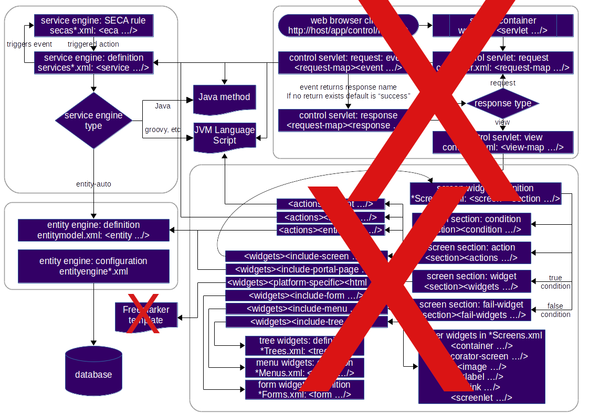

# 🌇 SunsetERP 🌇

**WARNING:** This project is still in development. It is not ready for production use or any use at all. But help is always welcome!

SunsetERP is based on a heavily modified version of [OFBiz](https://ofbiz.apache.org/) to run on Quarkus.

Here are some of the features of SunsetERP/OFBiz:
- Accounting (agreements, invoicing, vendor management, general ledger)
- Asset maintenance
- Catalogue and product management
- Facility and warehouse management system (WMS)
- Manufacturing execution / manufacturing operations management (MES/MOM)
- Order processing
- Inventory management, automated stock replenishment etc.
- Content management system (CMS)
- Human resources (HR)
- People and group management
- Project management
- Sales force automation
- Work effort management
- Electronic point of sale (ePOS)
- Electronic commerce (eCommerce)
- Scrum (development) (Scrum software development support)
- *and many more to come...* 

SunsetERP benefits from OFBiz usage of standard business data models.

## Delta with OFBiz
- SunsetERP is based on Quarkus
  - Why? Quarkus is faster and makes Java projects more lightweight.
- SunsetERP is API first (REST and SOAP)
  - Why? It makes it easier to integrate with other systems and create an SPA Single Page Application.
  - That being said the UI will be made with [PatternFLy](https://www.patternfly.org/) (of [RedHat](https://www.redhat.com/)) and [React](https://reactjs.org/). Because it looks way better than OFBiz UI. Sorry.
- SunsetERP is using a reactive architecture
- SunsetERP can be used in a microservices architecture more easily
- SunsetERP is using a different authentication system
  - Why? It makes it easier to integrate with other systems, to reduce the attack surface and to have something else not to worry about.
  - It will soon be able to work out of the box with [Keycloak](https://www.keycloak.org/).
    - Keycloak supports SAML 2.0, OpenID Connect, OAuth 2.0 and LDAP. So why reinvent the wheel?
  - So for more SSO and authentication options you will have to use Keycloak or some other system.

## What stays the same
- It is important to not stray away to far from the original OFBiz architecture and data model. This is to make sure that the project stays compatible with OFBiz plugins that already exist.
- It is important that it does not feel like a different project.
- The Data Models will stay untouched, but we might add new ones if need be.
- Entity Engine will stay untouched.
- Since Quarkus is used some changes to the usage of Groovy is to be expected.

### Why keep SOAP?
- SOAP is still used in many places and is still a very valid way of communicating with other systems. It is also very easy to use with Java.
- SOAP in the world of accounting, banking and finance is still very much used. It is also used in the world of logistics and supply chain management.

## Project Status
Still in dev mode.

## Nice to have
- https://kogito.kie.org/ (BPM and BRM)
- Have a similar plugin system as Keycloak
- Adapt ofbiz-plugins to this new setup
- Adapt it for better Process Mining

## History
- Confirmed have change for: [commit (on Aug 29, 2023)](https://github.com/apache/ofbiz-framework/commit/950be5b0aa2283147be6fc2ebdded06d09831627)
- The following change until Oct 2, 2023 are in none Java files (Groovy, Gradle and themes)
- Starting from this commit the changes are missing: [commit (Oct 2, 2023)](https://github.com/apache/ofbiz-framework/commit/d462fc88b6088baa25d02b09829df85fe6a176ca)
  - `framework/widget/dtd/widget-form.xsd` - was updated
- [commit (Oct 10, 2023)](https://github.com/apache/ofbiz-framework/commit/a0f9c2f99fb4deda7ae135af0be369e2cece3ab6) - unimportant front end
- [commit (Oct 11, 2023)](https://github.com/apache/ofbiz-framework/commit/14b97433ded543211a812277fe55b7fc9f241108) - Java library version
- [commit (Oct 13, 2023)](https://github.com/apache/ofbiz-framework/commit/2e084e71f2068e8ad3c0f7869313ac5261b3fb4c) - Java library version
- [commit (Nov 2, 2023)](https://github.com/apache/ofbiz-framework/commit/46701da3c3cffa5b4b3adea384050efb7b6179ef) - Need to apply the changes from OFBiz
  - `framework/service/entitydef/entitymodel.xml`
  - `framework/service/src/main/java/org/apache/ofbiz/service/job/JobManager.java`
  - `framework/service/src/main/java/org/apache/ofbiz/service/job/PersistedServiceJob.java`
- [commit (Nov 13, 2023)](https://github.com/apache/ofbiz-framework/commit/bfda8a6770eb0dcc1b6644d8639339fb8e44f40b) - Java library version
- [commit (Nov 20, 2023)](https://github.com/apache/ofbiz-framework/commit/577e968a3d6a3040cecb32f748e8e240189e2e9d) - Groovy
- [commit (Nov 24, 2023)](https://github.com/apache/ofbiz-framework/commit/9935270fcc1c883d4869e79e382df848737b8764) - Front end
  - `framework/widget/src/main/java/org/apache/ofbiz/widget/model/ModelFormField.java`
  - `framework/widget/src/main/java/org/apache/ofbiz/widget/model/XmlWidgetFieldVisitor.java`
- [commit (Dec 5, 2023)](https://github.com/apache/ofbiz-framework/commit/ca0433d0e40ed9ac1cb73ad53be4a555ca9a3542) - Front end
- [commit (Dec 5, 2023)](https://github.com/apache/ofbiz-framework/commit/afe62e2d7cdcf753bf44e53a3426529bac869fce)
  - `framework/base/testdef/basetests.xml`
- [commit (Dec 14, 2023)](https://github.com/apache/ofbiz-framework/commit/fb51a0ea5c4f7ff95b1586a5ca1c26e1ec50736f)
  - `framework/webapp/src/main/java/org/apache/ofbiz/webapp/control/LoginWorker.java`
- [commit (Dec 14, 2023)](https://github.com/apache/ofbiz-framework/commit/212fd5f4a1cc49495ce9c66ff96cf9a08326d547)
  - `framework/webapp/src/main/java/org/apache/ofbiz/webapp/control/LoginWorker.java`
- [commit (Dec 14, 2023)](https://github.com/apache/ofbiz-framework/commit/b87ff9e5b62d46bcf37f15e4a3f4c217cfd83ca9)
  - `framework/common/src/main/java/org/apache/ofbiz/common/CommonEvents.java`
  - The rest is UI stuff and controller stuff
- [commit (Dec 15, 2023)](https://github.com/apache/ofbiz-framework/commit/ee02a33509589856ab1ad08399e8dcee6b0edf58)
  - `framework/webapp/src/main/java/org/apache/ofbiz/webapp/control/LoginWorker.java`
- [commit (Dec 18, 2023)](https://github.com/apache/ofbiz-framework/commit/b6411f87c351d1696b54fdfc9a3609937dbec13f)
  - `framework/common/data/GeoData_IN.xml`
- [commit (Dec 23, 2023)](https://github.com/apache/ofbiz-framework/commit/0530a58d3a912520b7f9e46c5ccde98fd3737bf5) - Front end
- [commit (Dec 31, 2023)](https://github.com/apache/ofbiz-framework/commit/fd52ae3fe0bcc5edebff6f3fba939475f83c4a41) - 
  - pullAllPlugins and pullPlugin scripts
- [commit (Jan 1, 2024)](https://github.com/apache/ofbiz-framework/commit/cdb3e6e207e85879aa1744ed1464648bc9252327)
  - `.github/workflows/docker-image.yaml`
  - `.github/workflows/gradle.yaml`
  - `pullAllPluginsSource.sh`
- [commit (Jan 1, 2024)](https://github.com/apache/ofbiz-framework/commit/c7f606fe98621b8233d70e1c1f9793c525117c4c)
  - `NOTICE`
  - `applications/datamodel/data/demo/AccountingDemoData.xml`
- [commit (Jan 1, 2024)](https://github.com/apache/ofbiz-framework/commit/1eb5a52af41d096e56eb4671922075a01041515e)
  - `README.adoc`
  - `build.gradle` - It seems they commented out the code to pull plugin source
- [commit (Jan 2, 2024)](https://github.com/apache/ofbiz-framework/commit/e16c0b3ed5e428a9bc308c0a4266bd245e719db6)
  - pull plugin stuff
- [commit (Jan 2, 2024)](https://github.com/apache/ofbiz-framework/commit/2ed2cadca55f1d090359156c553f07705b4bed3a)
  - pull plugin stuff (empty?)
- [commit (Jan 3, 2024)](https://github.com/apache/ofbiz-framework/commit/d2f682c2d46a6c4b04153c986e72d7c4d9c43db8)
  - `README.adoc`
  - pull plugin stuff
- [commit (Jan 3, 2024)](https://github.com/apache/ofbiz-framework/commit/9bd538be3eef75eba33ae1c40e88ba7f90b2bdce)
  - pull plugin stuff
- [commit (Jan 4, 2024)](https://github.com/apache/ofbiz-framework/commit/bdbc08a4c2d91e11fae583655611ad84fa1f6c67)
  - pull plugin stuff
- [commit (Jan 4, 2024)](https://github.com/apache/ofbiz-framework/commit/7942b2b519f5433cf47481a2968442388b2b3e56)
  - pull plugin stuff
- [commit (Jan 4, 2024)](https://github.com/apache/ofbiz-framework/commit/95c0e0fbab6294f5505e3ec9b781b949cbe67afc)
  - front end
- [commit (Jan 6, 2024)](https://github.com/apache/ofbiz-framework/commit/a7665c37656c3aa6be7f820e0c379380a57aed2c)
  - pull plugin stuff
- [commit (Jan 8, 2024)](https://github.com/apache/ofbiz-framework/commit/708607d9cf3e99dc7558e2d24187fcb3eeebf0c6)
  - front end
- [commit (Jan 8, 2024)](https://github.com/apache/ofbiz-framework/commit/648c212e769759038bbb7fccacd1ada3af09899d)
  - `.github/workflows/docker-image.yaml`
- [commit (Jan 12, 2024)](https://github.com/apache/ofbiz-framework/commit/d17d06fd7c654621446320a98b45b3ebb859c648)
  - `framework/webapp/src/main/java/org/apache/ofbiz/webapp/control/ControlFilter.java`
- [commit (Jan 23, 2024)](https://github.com/apache/ofbiz-framework/commit/a41f0540ba3c7f99a1deb1d2d1efb55510cd19e1)
  - `applications/content/src/main/java/org/apache/ofbiz/content/content/ContentWrapper.java`
  - `applications/order/src/main/java/org/apache/ofbiz/order/order/OrderContentWrapper.java`
  - `applications/party/src/main/java/org/apache/ofbiz/party/content/PartyContentWrapper.java`
  - `applications/product/src/main/java/org/apache/ofbiz/product/category/CategoryContentWrapper.java`
  - `applications/product/src/main/java/org/apache/ofbiz/product/config/ProductConfigItemContentWrapper.java`
  - `applications/product/src/main/java/org/apache/ofbiz/product/product/ProductContentWrapper.java`
  - `applications/product/src/main/java/org/apache/ofbiz/product/product/ProductPromoContentWrapper.java`
- [commit (Jan 23, 2024)](https://github.com/apache/ofbiz-framework/commit/a07c44f51660f091feec66723017b3366b243b11)
  - `applications/datamodel/entitydef/order-entitymodel.xml`
  - `applications/order/src/main/java/org/apache/ofbiz/order/shoppingcart/ShoppingCart.java`
  - `applications/order/src/main/java/org/apache/ofbiz/order/shoppingcart/ShoppingCartItem.java`
  - `applications/product/servicedef/services_pricepromo.xml`
  - `applications/product/src/main/java/org/apache/ofbiz/product/price/PriceServices.java`
- [commit (Jan 29, 2024)](https://github.com/apache/ofbiz-framework/commit/fb6796f6cd74c95f682ab0788ae05412e1a26bf7)
  - `applications/accounting/src/main/java/org/apache/ofbiz/accounting/thirdparty/eway/GatewayConnector.java`
  - `applications/accounting/src/main/java/org/apache/ofbiz/accounting/thirdparty/paypal/PayPalEvents.java`
  - `applications/content/src/main/java/org/apache/ofbiz/content/data/DataResourceWorker.java`
  - `framework/base/src/main/java/org/apache/ofbiz/base/config/UrlLoader.java`
  - `framework/base/src/main/java/org/apache/ofbiz/base/conversion/NetConverters.java`
  - `framework/base/src/main/java/org/apache/ofbiz/base/location/StandardUrlLocationResolver.java`
  - `framework/base/src/main/java/org/apache/ofbiz/base/util/HttpClient.java`
  - `framework/base/src/main/java/org/apache/ofbiz/base/util/UtilURL.java`
  - `framework/base/src/test/java/org/apache/ofbiz/base/conversion/MiscTests.java`
  - `framework/common/src/main/java/org/apache/ofbiz/common/email/EmailServices.java`
  - `framework/service/src/test/groovy/org/apache/ofbiz/service/ModelServiceTest.groovy` - groovy
  - `framework/webtools/src/main/groovy/org/apache/ofbiz/webtools/datafile/ViewDataFile.groovy` - groovy
  - `framework/webtools/src/main/java/org/apache/ofbiz/webtools/artifactinfo/ArtifactInfoFactory.java`
- [commit (Feb 1, 2024)](https://github.com/apache/ofbiz-framework/commit/6a35d40d3b333d04f79704169035ed1bfc49c55e)
  - Some changes in `build.gradle`
- [commit (Feb 2, 2024)](https://github.com/apache/ofbiz-framework/commit/79242f65b3337be7c5218ef8902a16cc4e14134e)
  - `applications/order/src/main/java/org/apache/ofbiz/order/shoppingcart/ShoppingCartItem.java`
- [commit (Feb 2, 2024)](https://github.com/apache/ofbiz-framework/commit/279bb92f1ad267aea4945f319d84627503365f79)
  - `framework/minilang/src/main/java/org/apache/ofbiz/minilang/MiniLangRuntimeException.java`
  - `framework/minilang/src/main/java/org/apache/ofbiz/minilang/SimpleMethod.java`
  - `framework/minilang/src/main/java/org/apache/ofbiz/minilang/ValidationException.java`
  - `framework/minilang/src/main/java/org/apache/ofbiz/minilang/method/envops/Break.java`
  - `framework/minilang/src/main/java/org/apache/ofbiz/minilang/method/envops/Continue.java`
- [commit (Feb 2, 2024)](https://github.com/apache/ofbiz-framework/commit/55996c7ad077d50dac0d56ff7646e022efe9ff5d)
  - `framework/minilang/src/main/java/org/apache/ofbiz/minilang/SimpleMethod.java`
- [commit (Feb 2, 2024)](https://github.com/apache/ofbiz-framework/commit/3ebe5debb7305c02b5ca9fb3556ac47f0ec18cf9) - doc stuff
- [commit (Feb 2, 2024)](https://github.com/apache/ofbiz-framework/commit/a2f3ec88309f8440fe65b227ff3fc2df279dde24) - `build.gradle`
- [commit (Feb 2, 2024)](https://github.com/apache/ofbiz-framework/commit/502c56b3d9fb6bb5daf86bff364597d3548a6b3c)
  - `applications/content/src/main/java/org/apache/ofbiz/content/content/ContentWrapper.java`
  - `applications/order/src/main/java/org/apache/ofbiz/order/order/OrderContentWrapper.java`
  - `applications/party/src/main/java/org/apache/ofbiz/party/content/PartyContentWrapper.java`
  - `applications/product/src/main/java/org/apache/ofbiz/product/category/CategoryContentWrapper.java`
  - `applications/product/src/main/java/org/apache/ofbiz/product/config/ProductConfigItemContentWrapper.java`
  - `applications/product/src/main/java/org/apache/ofbiz/product/product/ProductContentWrapper.java`
  - `applications/product/src/main/java/org/apache/ofbiz/product/product/ProductPromoContentWrapper.java`
  - `applications/workeffort/src/main/java/org/apache/ofbiz/workeffort/content/WorkEffortContentWrapper.java`
- [commit (Feb 2, 2024)](https://github.com/apache/ofbiz-framework/commit/e7502ac544327a5d1c5602572219570cbedc3847)
  - `applications/content/src/main/java/org/apache/ofbiz/content/content/ContentWrapper.java`
  - `applications/product/src/main/java/org/apache/ofbiz/product/product/ProductPromoContentWrapper.java`
- [commit (Feb 2, 2024)](https://github.com/apache/ofbiz-framework/commit/625b80dbc626db35dddbaa62057e34b20ae7c38c)
  - `applications/product/src/main/java/org/apache/ofbiz/product/category/CategoryContentWrapper.java`
  - `applications/product/src/main/java/org/apache/ofbiz/product/config/ProductConfigItemContentWrapper.java`
  - `applications/product/src/main/java/org/apache/ofbiz/product/product/ProductContentWrapper.java`
  - `applications/product/src/main/java/org/apache/ofbiz/product/product/ProductPromoContentWrapper.java`
  - `applications/workeffort/src/main/java/org/apache/ofbiz/workeffort/content/WorkEffortContentWrapper.java`
- [commit (Feb 2, 2024)](https://github.com/apache/ofbiz-framework/commit/1d9df1edd0441f0638b866d0a8eb56c10b512ed9)
  - `applications/product/src/main/java/org/apache/ofbiz/product/product/ProductContentWrapper.java`
  - `applications/product/src/main/java/org/apache/ofbiz/product/product/ProductPromoContentWrapper.java`
- [commit (Feb 3, 2024)](https://github.com/apache/ofbiz-framework/commit/4b9fe4a2ea36ab4baf3ef73119813d5d1f3450f9)
  - `VERSION` - Does not seem to be important
- [commit (Feb 3, 2024)](https://github.com/apache/ofbiz-framework/commit/c81a7ad5f9b803cd6a553f9a0cdd1a9e868633d2)
  - `build.gradle` - Related to `groovyScripts`
- [commit (Feb 4, 2024)](https://github.com/apache/ofbiz-framework/commit/0d9ac6e4b22d1e0ba84913c43afe7243847ea833)
  - `framework/webapp/src/main/java/org/apache/ofbiz/webapp/control/LoginWorker.java`
- [commit (Feb 5, 2024)](https://github.com/apache/ofbiz-framework/commit/e4514d2f54e558064ad4253e49db51b6f3502a9a) - Groovy
- [commit (Feb 5, 2024)](https://github.com/apache/ofbiz-framework/commit/6ca26af8413e670a9f58c1bb9b624951b16e6b33)
  - `VERSION`
- [commit (Feb 5, 2024)](https://github.com/apache/ofbiz-framework/commit/c156ab44141ff166f6620e754ac01df00d5e8a1f)
  - Groovy
- [commit (Feb 5, 2024)](https://github.com/apache/ofbiz-framework/commit/b39705474062afe91aec6a35a6311cc4a242e078)
  - `build.gradle`
- [commit (Feb 5, 2024)](https://github.com/apache/ofbiz-framework/commit/6d31c0d3ebcffe62b2a0adc8af04564d4033d990)
  - `build.gradle`
- [commit (Feb 5, 2024)](https://github.com/apache/ofbiz-framework/commit/8945a9cbb30677f0dc1a9d543a0b3537268a2b98)
  - `build.gradle`
- [commit (Feb 5, 2024)](https://github.com/apache/ofbiz-framework/commit/56bd57a3747b1760dd133a557638b5f50f8eeda9)
  - `build.gradle`
- [commit (Feb 6, 2024)](https://github.com/apache/ofbiz-framework/commit/6708f750ee51319f48a8e59238630dae76c21976)
  - `framework/common/webcommon/WEB-INF/common-controller.xml`
- [commit (Feb 6, 2024)](https://github.com/apache/ofbiz-framework/commit/eadf86aa7e4e98efdc03d7141dfc8ee874f26e5a)
  - `applications/party/widget/partymgr/PartyMenus.xml` - View stuff
- [commit (Feb 8, 2024)](https://github.com/apache/ofbiz-framework/commit/cd67b3e5ab10fe8d9703eeef2cb2f752a3f971ae)
  - `docker/examples/postgres-demo/docker-compose.yml`
- [commit (Feb 8, 2024)](https://github.com/apache/ofbiz-framework/commit/7f2e61c14af16004505524f8b74c17a0c321c889) - Doc stuff
- [commit (Feb 8, 2024)](https://github.com/apache/ofbiz-framework/commit/836b55ef78dd46acb39aea55503407354a62f125) - Doc stuff
- [commit (Feb 9, 2024)](https://github.com/apache/ofbiz-framework/commit/14b80e952fc2730972026276fadf0ea379157255) - Front end
- [commit (Feb 9, 2024)](https://github.com/apache/ofbiz-framework/commit/0b7145f86cfb81c9887f4e3ffb7b8e9053433f4d) - Doc stuff
- [commit (Feb 9, 2024)](https://github.com/apache/ofbiz-framework/commit/26e7e96cb280a695a3981b2be0369d62991379e8) - Doc stuff
- [commit (Feb 10, 2024)](https://github.com/apache/ofbiz-framework/commit/e1b053e0b49fdbcb6021f035ae82e0a60ec9e3af) - Doc stuff
- [commit (Feb 14, 2024)](https://github.com/apache/ofbiz-framework/commit/11ae98b9983c2ff9808e680791da6380df43f7a4) - Doc stuff
- [commit (Feb 14, 2024)](https://github.com/apache/ofbiz-framework/commit/e24688c1ad8e53a9fd227fcc9e29d8b9e2c3a56e) - Doc stuff
- [commit (Feb 14, 2024)](https://github.com/apache/ofbiz-framework/commit/a34a8799ba70a20e2b3388bf5f4a1d9ca0021263) - Front end

## Notes about Paths:
```groovy
groovyScripts {
        groovy {
            srcDirs += getDirectoryInActiveComponentsIfExists('src/main/groovy')
            compileClasspath += sourceSets.main.compileClasspath
            compileClasspath += sourceSets.main.output
        }
```
Might need to investigate: 
- `sourceSets.main.compileClasspath`
- `sourceSets.main.output`

## TODO
- [x] Change the name of the directories to use `sunseterp` instead of `ofbiz`
- [x] Create API for framework infos and health
- [x] Update Gradle
- [x] Update Quarkus
- [x] What is the version of OFBiz did I used to start? -- anything after [commit (on Aug 29, 2023)](https://github.com/apache/ofbiz-framework/commit/950be5b0aa2283147be6fc2ebdded06d09831627). For the documentation: **2024-04-20**.
- [ ] Refactor `build.gralde`
  - [ ] Analyse
  - [ ] Refactor and make sure the code is being merged properly
  - [ ] Refactor CLASSPATH (`System.getProperty("java.class.path");`)
    - [ ] Analyse is `component-load.xml` for `applications/` and `framework/` are being removed from Gradle level
    - [ ] Add the different paths for framework and applications since we are dividing not like OFBiz that merges them
      - [ ] Document this somewhere
    - [ ] Add the different paths for resources so that they can be found when `.getRecourse()` method is called
  - [ ] Refactor the tasks
    - [ ] Plugin management tasks
    - [ ] Clean tasks
    - [ ] Others
  - [ ] Refactor eclipse stuff
- [ ] Documentation refactoring
  - [x] Analyse
  - [x] Move all the doc in the `./docs/` directory -- **2024-04-20**.
  - [x] Refactor if needed the `build.gradle` to be able to generate the documentation
  - [ ] Make sure that it outputs in those formats at least: 
    - [x] HTML
    - [x] PDF
    - [ ] ePub
    - [ ] GitHub Wiki
    - [ ] Readthedocs
- [x] Start writing documentation for SunsetERP
  - [x] Document components of `build.gradle`
  - [ ] Document the structure and the delta with OFBiz
  - [ ] Document about the resources
- [ ] Load all components from OFBiz (the Gradle refactoring needs to be done first)
- [ ] Replace but also keep `component-load.xml` with `component-load.properties` using cascading
- [ ] Replace the other *XML* format configuration file with `.properties` using cascading (trying to standarized all the configurations with what already exists with Quarkus) (keep support for *XML* because of not wanting to break plugins *"for now"*)
- [ ] Replace and keep Entities with YAML (some *XML* are too complicated to be readable and usable with `.properties`)
- [ ] Nice to have: little `Gradle` script to replace *XML* with `.properties` or YAML and check the rest of the code to see what else needs to be refactored to work with SunsetERP (since the merging will be different)
- [ ] Add load all data
  - [ ] Analyse
  - [ ] Add the refactored code from `build.gradle`
- [ ] Create a REST API for all components from OFBiz with the help of OpenAPI
  - [ ] Analyse
  - [ ] Use OFBiz services to generate API endpoints
  - [ ] Analyse if `controller.xml` can be used
- [ ] Adapt code so that it uses HATEOAS to make sure it is fully complies with RestFul standard
  - [ ] Analyse
- [ ] Error handling for Rest APIs
  - [ ] Create a custom exception handler
  - [ ] Create a custom error response
  - [ ] Centralize error handling and error messages
- [ ] Create a SOAP API for all components that might need SOAP
  - [ ] Analyse (might not use)
- [ ] Error handling for SOAP APIs
  - [ ] Analyse
- [x] Update code to support the latest Quarkus version
- [ ] Add support for the latest Java version (Quarkus 3.9 the version currently used only supports Java version 17 and 21... So the version switch should be to Java 21)
- [ ] Change library `AWT` for image modification (e.g.: `net.coobird.thumbnailator`, `org.apache.xmlgraphics`, `Twelvemonkeys ImageIO`) - Quarkus might not support AWT fully, and it is a bit old
- [ ] Add Unit Tests
   - [ ] Analyse
- [ ] Add Unit Tests for OpenAPI
  - [ ] Analyse (does it even exist? Validation?)
- [ ] Update code with the changes that are from the OFBiz repository
- [ ] Add OpenTelemetry for tracing
- [ ] Integration with Keycloak
  - [ ] Analyse
- [ ] Add integration tests
- [ ] Add support for OpenSearch and ElasticSearch
- [ ] `.github/workflows` for CI/CD
- [ ] **Optional** Integration with Vault, Mozilla Sops and other secret management systems
- [ ] Add performance tests
  - [ ] Analyse (e.g.: eBPF, BCC)
  - [ ] Create jMeter test profiles
- [ ] Refactor code to make it faster
  - [ ] Analyse (maybe do it at the same time as adding performance testing)
- [ ] Add support for `./lib/` for Keycloak plugin management (OFBiz also has it)
- [ ] Add integration testing
  - [ ] Analyse (What to test? How to test?)
  - [ ] Databases: 
    - [ ] PostgresSQL
    - [ ] MySQL, MariaDB
    - [ ] MSSQL
  - [ ] Search
    - [ ] Solr
    - [ ] OpenSearch
    - [ ] ElasticSearch
  - [ ] Data transfer
    - [ ] Kafka
    - [ ] Apache Airflow
    - [ ] SQS (maybe others from AWS)
  - [ ] Data storage
    - [ ] Ceph
    - [ ] S3
  - [ ] OpenTelemetry compliance
  - [ ] Logging performance (Netflix)
- [ ] Add security tests
  - [ ] Analyse (Can Kali help? What others are doing? Other similar standards to PCI-DSS)
  - [ ] PCI-DSS ([PCI-DSS | endoflife.date](https://endoflife.date/pci-dss), [PCI DSS v4.0 Resource Hub | Blog | PCI Security Standard](https://blog.pcisecuritystandards.org/pci-dss-v4-0-resource-hub), [PA/DSS certified](https://www.pcisecuritystandards.org/assessors_and_solutions/payment_applications?category=PA-DSS+certified))
  - [ ] GitHub Workflow that will search CVEs to see of it affects one of the libraries and what version
    - [ ] Analyse (what is in market)
- [ ] Add privacy tests (new EU and Qc regulations)
  - [ ] Analyse
- [ ] Test for legal (copyright)
  - [ ] Analyse (GitHub workflow)
- [ ] Tests microservices
  - [ ] Analyse (what is in market... Chaos Monkey, etc.) (since we are using Quarkus with Keycloak, OpenSearch, etc. we need to make sure that they are working properly even when one of those services goes down)
- [ ] Redo front-end with HTMX+RVST+HTMT+jQuery+PatternFly special pattern (remove \n \r tidy up)
  - [ ] Analyse
  - [ ] Redo what was already done with HTMX+RVST+HTMT+jQuery+PatternFly special pattern
  - [ ] Unit tests
  - [ ] HTML validation
  - [ ] CSS validation
  - [ ] Lint validation
  - [ ] Functional testing with Cypress
  - [ ] Refactor flt files to use HTMX+RVST+HTMT
  - [ ] Refactor widgets to use HTMX+RVST+HTMT
  - [ ] Refactor screens to use HTMX+RVST+HTMT
  - [ ] Refactor forms to use HTMX+RVST+HTMT
  - [ ] Refactor menus to use HTMX+RVST+HTMT
  - [ ] Refactor themes to use HTMX+RVST+HTMT
  - [ ] Refactor images to use HTMX+RVST+HTMT
  - [ ] Refactor actions to use HTMX+RVST+HTMT
  - [ ] Remove all the screen code stuff since it is not needed anymore
  - [ ] Remove all the request-map, `controller.xml` stuff since it is not needed anymore
  - [ ] Remove all the `web.xml` stuff since it is not needed anymore
  - [ ] Remove all the Freemarker (template engine) stuff since it is not needed anymore
- [ ] Process Mining testing
  - [ ] Analyse (make sure that SunsetERP returns what is needed for Process Mining. Also, is it possible to automate tests for Process mining? Document...)
- [ ] Create tool to automate delta testing between SunsetERP and OFBiz to alert of any changes (the changes will always be done manually)
  - [ ] Analyse (GitHub Workflows)
- [ ] Add support for BRM and BPM from kie
  - [ ] Analyse
- [ ] Add [Editor.js](https://editorjs.io/) or [Quilljs](https://quilljs.com/)... maybe both?
  - [ ] Analyse
- [ ] Copy as many features from WordPress as possible for Blogs (RSS feeds, etc.)
- [ ] Add functions for CRM
  - [ ] Analyse
  - [ ] Add support for Twilio and other phone services (log calls and SMS/MMS) (record calls (gstreamer), record SMS/MMS, etc) (audio to text (gstreamer and PyTorch or whatever))
  - [ ] Add support for social media (posts, chat, etc.)
- [ ] Add payment support
  - [ ] Analyse (PayPal and Stripe are the minimums)
  - [ ] PayPal
  - [ ] Stripe
- [ ] Tax libraries support
  - [ ] Analyse (taxware... maybe there are others)
- [ ] Add more accounting features
  - [ ] Analyse
- [ ] Add more features to ticketing
  - [ ] Analyse
- [ ] Cellphone code
  - [ ] Analyse (using the same principle as the web frontend)
  - [ ] Android
    - [ ] Analyse (PatternFly has a library for Kotlin)
  - [ ] iOS (iPhone and iPad)
    - [ ] Analyse (PatternFly??? or use Apple's GUI but still follow the frontend principal)
- [ ] Desktop code
  - [ ] Analyse
  - [ ] Windows (C# .NET WEF or whatever is the latest)
  - [ ] MacOS (Swift)
  - [ ] Linux (GTK, QT, X11, Wayland)
- [ ] BI tools integration
  - [ ] Analyse
- [ ] Create demos
  - [ ] Blog website
  - [ ] Wiki (wiki type website for internal and external content)
  - [ ] eCommerce (the usual and inventory management, inventory from other sources, online marketplace (PayPal and Stripe))
  - [ ] Employee management (similar to others) (give their hours, vacation management, employee budgets, custom components)
  - [ ] CRM (Twilio, similar functions to Salesforce, etc.)
  - [ ] Payment management (Accounting)
  - [ ] Budgeting (Accounting)
    - [ ] Analyse (what is the market (e.g.: MovieMagic), etc.)
  - [ ] Bank (we have too)
  - [ ] Insurance service application (use kie as much as possible, examples of complex business logic)
  - [ ] ISP provider (sell cellphone, sell cellphone services, sell internet access, call in technicians, manage inventory, usage, subscription management, invoice, etc)
  - [ ] Uber clone
- [ ] Divorce `./framework` and `./applications` (maybe bring it up)
  - [ ] Analyse (the framework should be a seperate project with the entity engine and applications should be components a dev could add or remove or even modify (adding it to plugins or `libs` or even Restful))
  - [ ] Analyse if possible to use `@decorators` to clean up the code and modernize it
  - [ ] It needs to be possible to call other applications without needing to `import` the code (should be possible to `import` or do a RestFul call)
    - [ ] Analyse
- [ ] Create a separate library for the framework and give it a name and each application should have their own repo
- [ ] Divorce *entity engine* from *applications* so that a Gradle script can build the data model in a separate env like CI/CD without needing to include all the code in the application code (lets make this light)
- [ ] Re-write all the demos to support the new structure
- [ ] Add AI for QA
  - [ ] Analyse (what is in the market)
  - [ ] Add AI for testing
  - [ ] Add AI for code review (AWS CodeGuru)
  - [ ] Security testing AI (AWS GuardDuty)
- [ ] Come up with some new ideas!

Abstraction: 
> 1. A developer should be able to easily build a ERP microservices env.
> 2. A developer should not need to put too much energy on the front end and not have any business (or very little) in the front-end (no more Angular and React or whatever else that causes people to replicate everything on the frontend (INSANITY!!))
> 3. API first (HATEOAS)
> 4. Decoupling should be easy
> 5. Make applications lighter and more portable
> 6. Add features to be more attractive vs Salesforce and Odoo
> 7. Better testing to catch more issues (currently there are broken parts of OFBiz and for some reason it hasn't been caught)
> 8. So in other words, we need better QA
> 9. Demos help others see what can be done and how

Here is what the architecture should look like after the refactoring: 


## Comparisons
- [Comparison of shopping cart software](https://en.wikipedia.org/wiki/Comparison_of_shopping_cart_software)
- [Comparison of accounting software](https://en.wikipedia.org/wiki/Comparison_of_accounting_software)
- [Comparison of CRM systems](https://en.wikipedia.org/wiki/Comparison_of_CRM_systems)
- [Comparison of ERP software packages](https://en.wikipedia.org/wiki/Comparison_of_ERP_software_packages)
- [Comparison of time-tracking software](https://en.wikipedia.org/wiki/Comparison_of_time-tracking_software)
- [Comparison of project management software](https://en.wikipedia.org/wiki/Comparison_of_project_management_software)

## Getting Started
This project uses Quarkus, the Supersonic Subatomic Java Framework.

If you want to learn more about Quarkus, please visit its website: https://quarkus.io/ .

## Running the application in dev mode

You can run your application in dev mode that enables live coding using:
```shell script
./gradlew quarkusDev
```

> **_NOTE:_**  Quarkus now ships with a Dev UI, which is available in dev mode only at http://localhost:8080/q/dev/.

## Packaging and running the application

The application can be packaged using:
```shell script
./gradlew build
```
It produces the `quarkus-run.jar` file in the `build/quarkus-app/` directory.
Be aware that it’s not an _über-jar_ as the dependencies are copied into the `build/quarkus-app/lib/` directory.

The application is now runnable using `java -jar build/quarkus-app/quarkus-run.jar`.

If you want to build an _über-jar_, execute the following command:
```shell script
./gradlew build -Dquarkus.package.type=uber-jar
```

The application, packaged as an _über-jar_, is now runnable using `java -jar build/*-runner.jar`.

## Creating a native executable

You can create a native executable using: 
```shell script
./gradlew build -Dquarkus.package.type=native
```

Or, if you don't have GraalVM installed, you can run the native executable build in a container using: 
```shell script
./gradlew build -Dquarkus.package.type=native -Dquarkus.native.container-build=true
```

You can then execute your native executable with: `./build/sunseterp-1.0.0-SNAPSHOT-runner`

If you want to learn more about building native executables, please consult https://quarkus.io/guides/gradle-tooling.

## Related Guides

- SmallRye OpenAPI ([guide](https://quarkus.io/guides/openapi-swaggerui)): Document your REST APIs with OpenAPI - comes with Swagger UI
- RESTEasy Reactive ([guide](https://quarkus.io/guides/resteasy-reactive)): A Jakarta REST implementation utilizing build time processing and Vert.x. This extension is not compatible with the quarkus-resteasy extension, or any of the extensions that depend on it.
- OpenID Connect ([guide](https://quarkus.io/guides/security-openid-connect)): Verify Bearer access tokens and authenticate users with Authorization Code Flow
- Elytron Security Properties File ([guide](https://quarkus.io/guides/security-properties)): Secure your applications using properties files
- SmallRye Health ([guide](https://quarkus.io/guides/smallrye-health)): Monitor service health

## Provided Code

### RESTEasy Reactive

Easily start your Reactive RESTful Web Services

[Related guide section...](https://quarkus.io/guides/getting-started-reactive#reactive-jax-rs-resources)

### SmallRye Health

Monitor your application's health using SmallRye Health

[Related guide section...](https://quarkus.io/guides/smallrye-health)

## Copyright
Jean-Nicolas Boulay Desjardins and Apache Foundation. All rights reserved. 2024.
